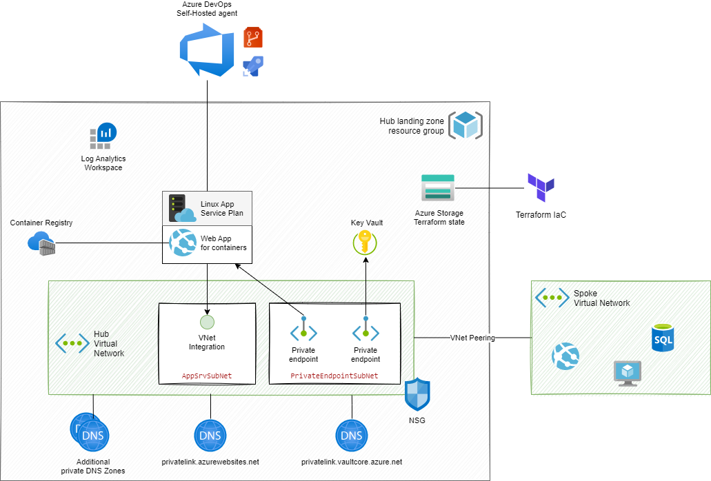
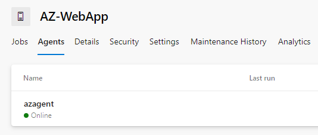

# Azure Landing zone with Azure DevOps self-hosted agent

## Overview
This repository demonstrates how to setup a landing zone containing a storage account for your terraform state file and an Azure DevOps self-hosted agent enabling secure deployment of your application within an Azure protected infrastructure (e.g within a spoke virtual network).

The following schema illustrates the deployed infrastructure provided by the AZ CLI scripts in this repository.

The Azure DevOps self-hosted agent is built using a docker image, following the [Microsoft tutorial](https://docs.microsoft.com/en-us/azure/devops/pipelines/agents/docker?view=azure-devops).

This architecture gives the reader an alternative to Virtual Machine Scale Sets or container solutions such as Azure Container Instance or Azure Kubernetes Services. This solution is based on an fully PaaS solution, Azure Web App for Containers.

## Repository content

This repository contains the following resources:
* The script `initialize-hub-rg.ps1` is the entry point to deploy this architecture
* The `module` directory contains all Powershell scripts executed by the `initialize-hub-rg.ps1` script
* The `az-agent` directory contains the definition of the Azure DevOps self-hosted docker image. A kube config file is provided as example in case you need to deploy services into a Kubernetes cluster
* The `devops-pipelines` directory gives you a ready-to-use Azure DevOps YAML pipeline allowing you to automatize the deployment of a new version of your self-hosted agent 

## How to deploy this architecture

First of all, you need to create your Azure DevOps Agent Pool (identified by the Powershell parameter `$AZP_POOL`), selecting the self-hosted agent configuration.

Then, you need to create a personal access token (identified by the Powershell parameter `$AZP_TOKEN`) that has the `read & manage` permissions on Agent Pools. The value of the token will be stored in the Azure Key Vault when running the `initialize-hub-rg.ps1` script.

The Azure devOps URL (identified by the Powershell parameter `$AZP_URL`) is given by `https://dev.azure.com/<YOUR-ORGANIZATION>`.

Finally, give your agent a name that will be created within your Azure DevOps organization (identified by the Powershell parameter `$AZP_AGENT_NAME`).

    az login --tenant <YOUR-TENANT>
    az account set --subscription <YOUR-SUBSCRIPTION>

    .\initialize-hub-rg.ps1 `
        -resourceGroupName $resourceGroupName `
        -location $location `
        -logAnalyticsWorkspaceName $logAnalyticsWorkspaceName `
        -keyVaultName $keyVaultName `
        -acrName $acrName `
        -storageAccountName $storageAccountName `
        -vnetName $vnetName `
        -vnetAddresses $vnetAddresses `
        -privateEndpointSubnetAddresses $privateEndpointSubnetAddresses `
        -appSrvSubnetAddresses $appSrvSubnetAddresses `
        -nsgName $nsgName `
        -appServicePlanName $appServicePlanName `
        -appName $appName `
        -AZP_POOL $AZP_POOL `
        -AZP_AGENT_NAME $AZP_AGENT_NAME `
        -AZP_URL $AZP_URL `
        -AZP_TOKEN $AZP_TOKEN `
        -additionalDnsZones $additionalDnsZones

The following picture illustrates the agent with name `azagent` created inside the `AZ-WebApp` agent pool.

